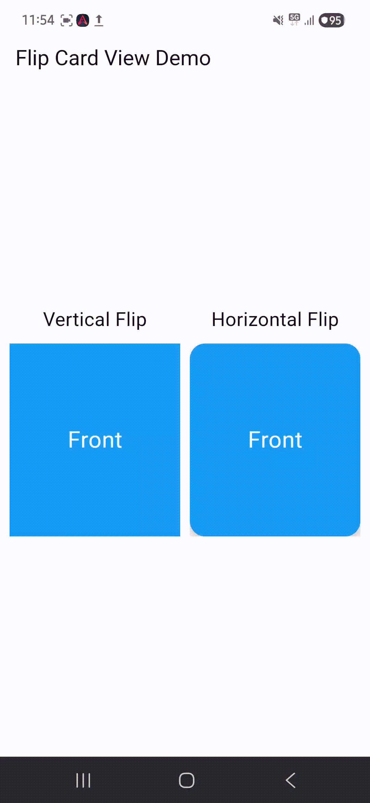

# library_flutter_flipcardview

A reusable Flutter package that provides beautiful horizontal and vertical flip card animations with customizable duration, curves, and tap-to-flip support.

## When To Use

*   **Flash Cards**: Perfect for educational apps where users need to flip cards to see answers.
*   **Quiz Applications**: Interactive way to reveal correct options or explanations.
*   **Product Cards**: Show product images on the front and details/prices on the back.
*   **Credit Card UI**: Seamlessly flip between the front and back of a virtual credit card.
*   **Learning Apps**: Enhance user engagement with interactive elements.
*   **Interactive Dashboards**: Hide complex details behind a simple card view.
*   **Portfolio Apps**: Showcase projects with a flip reveal effect.

## Perfect For

*   **Flash Cards**
*   **Quiz Applications**
*   **Product Cards**
*   **Credit Card UI**
*   **Learning Apps**
*   **Interactive Dashboards**
*   **Portfolio Apps**

## Features

| Feature | Status |
| :--- | :--- |
| ✅ Horizontal Flip Animation | Supported |
| ✅ Vertical Flip Animation | Supported |
| ✅ Tap To Flip | Supported |
| ✅ Custom Animation Duration | Supported |
| ✅ Custom Animation Curves | Supported |
| ✅ Material 3 Compatible | Supported |
| ✅ Lightweight | Supported |
| ✅ Null Safe | Supported |
| ✅ Supports Any Widget | Supported |
| ✅ Easy Integration | Supported |

## Parameters

| Parameter     | Type          | Default                     | Description                           |
| ------------- | ------------- | --------------------------- | ------------------------------------- |
| front         | Widget        | required                    | Front side widget                     |
| back          | Widget        | required                    | Back side widget                      |
| flipDirection | Flipdirection | required                    | Horizontal or Vertical flip direction |
| duration      | Duration      | Duration(milliseconds: 600) | Flip animation duration               |
| curve         | Curve         | Curves.easeInOut            | Animation curve                       |

## Installation

Add this to your package's `pubspec.yaml` file:

```yaml
dependencies:
  library_flutter_flipcardview: ^0.0.1
```

Or run:

```bash
flutter pub add library_flutter_flipcardview
```

## Import

```dart
import 'package:library_flutter_flipcardview/library_flutter_flipcardview.dart';
```

## Usage Examples

### Simple Horizontal Flip
```dart
Flipcardview(
  front: Container(
    width: 200,
    height: 200,
    color: Colors.blue,
    child: Center(child: Text("Front")),
  ),
  back: Container(
    width: 200,
    height: 200,
    color: Colors.red,
    child: Center(child: Text("Back")),
  ),
  flipDirection: Flipdirection.horizontal,
)
```

### Simple Vertical Flip
```dart
Flipcardview(
  front: Container(
    width: 200,
    height: 200,
    color: Colors.orange,
    child: Center(child: Text("Front")),
  ),
  back: Container(
    width: 200,
    height: 200,
    color: Colors.green,
    child: Center(child: Text("Back")),
  ),
  flipDirection: Flipdirection.vertical,
)
```

## Full Example

```dart
import 'package:flutter/material.dart';
import 'package:library_flutter_flipcardview/library_flutter_flipcardview.dart';

void main() {
  runApp(const MyApp());
}

class MyApp extends StatelessWidget {
  const MyApp({super.key});

  @override
  Widget build(BuildContext context) {
    return MaterialApp(
      debugShowCheckedModeBanner: false,
      home: Scaffold(
        appBar: AppBar(
          title: const Text('FlipCardView Demo'),
          centerTitle: true,
        ),
        body: Center(
          child: Column(
            mainAxisAlignment: MainAxisAlignment.center,
            children: [
              const Text(
                'Horizontal Flip',
                style: TextStyle(fontSize: 18, fontWeight: FontWeight.bold),
              ),
              const SizedBox(height: 10),
              Flipcardview(
                front: Container(
                  width: 200,
                  height: 200,
                  decoration: BoxDecoration(
                    color: Colors.blue,
                    borderRadius: BorderRadius.circular(12),
                  ),
                  child: const Center(
                    child: Text('Front Side', style: TextStyle(color: Colors.white, fontSize: 20)),
                  ),
                ),
                back: Container(
                  width: 200,
                  height: 200,
                  decoration: BoxDecoration(
                    color: Colors.red,
                    borderRadius: BorderRadius.circular(12),
                  ),
                  child: const Center(
                    child: Text('Back Side', style: TextStyle(color: Colors.white, fontSize: 20)),
                  ),
                ),
                flipDirection: Flipdirection.horizontal,
              ),
              const SizedBox(height: 40),
              const Text(
                'Vertical Flip',
                style: TextStyle(fontSize: 18, fontWeight: FontWeight.bold),
              ),
              const SizedBox(height: 10),
              Flipcardview(
                front: Container(
                  width: 200,
                  height: 200,
                  decoration: BoxDecoration(
                    color: Colors.orange,
                    borderRadius: BorderRadius.circular(12),
                  ),
                  child: const Center(
                    child: Text('Front Side', style: TextStyle(color: Colors.white, fontSize: 20)),
                  ),
                ),
                back: Container(
                  width: 200,
                  height: 200,
                  decoration: BoxDecoration(
                    color: Colors.green,
                    borderRadius: BorderRadius.circular(12),
                  ),
                  child: const Center(
                    child: Text('Back Side', style: TextStyle(color: Colors.white, fontSize: 20)),
                  ),
                ),
                flipDirection: Flipdirection.vertical,
              ),
            ],
          ),
        ),
      ),
    );
  }
}
```

## Demo

Horizontal Flip & Vertical Flip




## License

MIT License

Copyright (c) 2026 Excelsior Technologies

Permission is hereby granted, free of charge, to any person obtaining a copy
of this software and associated documentation files (the "Software"), to deal
in the Software without restriction, including without limitation the rights
to use, copy, modify, merge, publish, distribute, sublicense, and/or sell
copies of the Software, and to permit persons to whom the Software is
furnished to do so, subject to the following conditions:

The above copyright notice and this permission notice shall be included in all
copies or substantial portions of the Software.

THE SOFTWARE IS PROVIDED "AS IS", WITHOUT WARRANTY OF ANY KIND, EXPRESS OR
IMPLIED, INCLUDING BUT NOT LIMITED TO THE WARRANTIES OF MERCHANTABILITY,
FITNESS FOR A PARTICULAR PURPOSE AND NONINFRINGEMENT. IN NO EVENT SHALL THE
AUTHORS OR COPYRIGHT HOLDERS BE LIABLE FOR ANY CLAIM, DAMAGES OR OTHER
LIABILITY, WHETHER IN AN ACTION OF CONTRACT, TORT OR OTHERWISE, ARISING FROM,
OUT OF OR IN CONNECTION WITH THE SOFTWARE OR THE USE OR OTHER DEALINGS IN THE
SOFTWARE.
